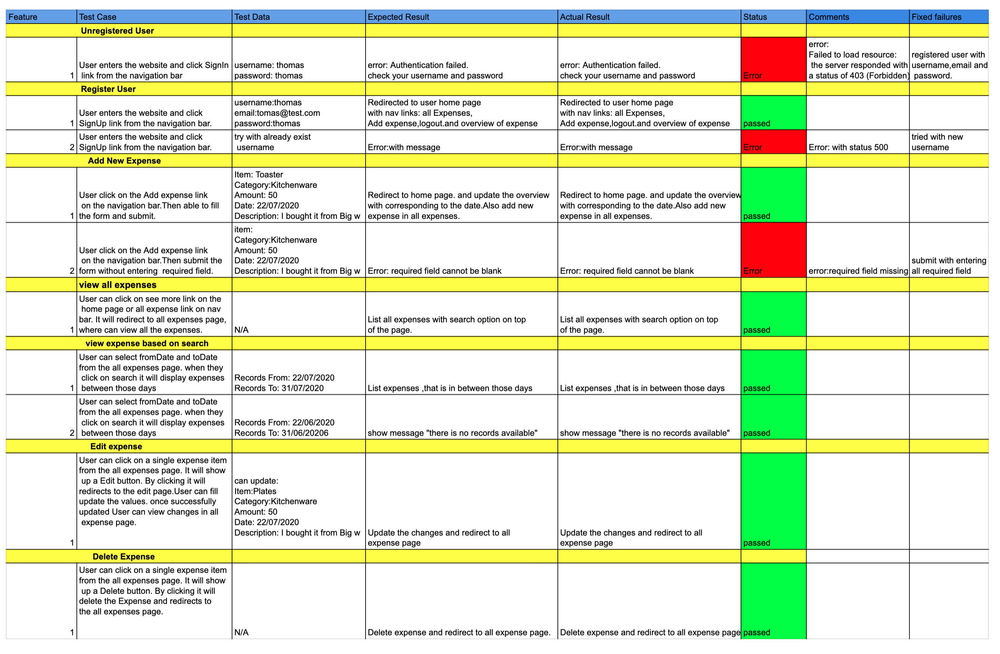

## Expense-Tracker-App
---
### Developed-By: Tegan Kelly and Shamseera Kurumbeth
---
#### Run Instructions
* Client Side: run ```yarn start``` on terminal.
* Server Side: run ```npm run server``` on terminal.
* Cypress Start on client: run ```npx cypress open``` on terminal.
---
#### R1 - Well Designed Code

##### **Modules**
The code files for the application is separated into two, that are linked to two separate Github repositories, expense-tracker-client and expense-tracker-server.

###### Front-end


The front end code is categorised into folders based on their purpose:
* The assets folder contains images.
* The docs folder contains all the documents used for the readme.
* The components folder contains components that make up each page of the website. Some of the components are reused throughout the website such as navigation bar.
* The config folder contains global states and api files.
* The data folder contains some dummy data.
* The services folder contains three different files for authentication,user and expense. These files handles all the functions which are reused throughout the application.

###### Back-end


The back end code is categorised into different folders based on their purpose:
* The config folder contains the passport configuration.
* The utils folder contains all the utility functions, that are separated into different files according to their functionalities.
* The controllers folder contains code where  Express interacts with the MongoDB Atlas database to store and retrieve data. Controllers are grouped by the functionality/page. For example add expense,delete expense,update expense and read expenses are contained in the expense-controller file.
* The models folder contains the mongoose schema for each collection.
* The routes folder contains the routes used by the Express routers. The routers are grouped by page/functionality. For example all expense routes are contained in the expense-routes file.
* The test folder contains the configurations and mocha test files.
* The testResults folder to store the results of mocha tests.

##### **DRY Coding principles**

##### **Libraries**
* Cypress is used for automated integration testing.
* Axios is used to shorten the code required to make HTTP requests.
* Date-fns is used to easily format javascript dates into a user-friendly format.
* Dotenv is used to load variables from the .env and .env.development files into process.env variables which can be accessed throughout the application.
* material ui is used for styling the components. And different components of material ui also used through out the application.
* Cors is used to enable data to be transmitted between the back end and the front end, allowing the use of a custom API.
* Nodemon is used to allow the express server to restart automatically after each code change.
* passport and passport local mongoose are used to do the user authentication
* mocha test is used in the back end for the unit testing.

##### **Code Flow Control**

During the coding process we used the user stories as a basis for the code control flow. Each function usually contains the expected output in the case of a positive use case, includes error handling to accommodate for negative use cases.

##### **Applies Object Oriented (OO) principles/patterns**

Functions and objects are used extensively throughout the application. Each component is written as a functional component with the functionality for that page. The following structure is usually followed:

- a) Functional component name
- b) Used ```useState``` to manage the state of the object.
- c) Used ``useEffect`` to fetch data from the MongoDB database and render it on the page
- d) Functions to control page functionality. For example,a function to handle the form submission.
- e)Export that function to display the contents of the page through rendering from other components.

For example, when a newExpense form is completed in the front end, a new expense object is created from the values of the form. The object is then saved as a document in the corresponding collection via a HTTP request to the back end.

---
#### R2 - Employ and utilise proper source control methodology (git)

Through out this project, out team followed the git feature branch workflow. Initially a central repository  was created and ```master``` represents the official project history. New feature branches were created every time we start work on a new feature. So we can edit, stage, and commit changes to the feature branch. Once we finished with the feature branch, we pushed to the central repository in github. To get feedback on the new feature branch, we created a pull request in github. Pull requests were reviewed by a team member other than the creator, to ensure shared workload, and keep all team members across changes in code. Where changes were required, the team worked together to resolve, otherwise the merge was conducted. 

In the event of merge conflicts, the team verbally checked with the person whose code is causing the conflicts to determine the resolution. Once resolve the conflicts again raise new pull request. When pull request is approved and conflict-free, we added our code to the master branch.

---
#### R3	- Use a recognised project management methodology
Trello was used as a tool for project management. Lists including: ```todo```,  ```in progress``` and ```completed``` were used, upon which cards were created for managing the development of the application. Properties such as checklists, due time and name of the member who is handling that story/card were used throughout.

**Screenshots:** <br>
11/07/2020 <br>
 <br>
 <br>
 <br>

16/07/2020 <br>
 <br>

17/07/2020 <br>
 <br>
 <br>
 <br>

18/07/2020 <br>
 <br>

22/07/2020 <br>
 <br>

25/07/2020 <br>
 <br>

31/07/2020
 <br>

---

#### R4 - Use a recognised task delegation methodology
Tags were used to delegate cards to team members, with the flexibility of having multiple team members listed for one card, if needed. 
See above screenshots for examples of tag usage.

---

#### R5 - Produce a working application that meets user needs
In our application registered user can add a new expense. Once they added a new expense, they can view all expense and their expense overview of the current month and recent dates as well in our application. It also possible to update and delete the expense details. 

---

#### R6 - Deploy the application to a cloud hosting service
Server code for this expense tracking application is hosted on the Heroku platform. 
Client side code for this application has been deployed through Netlify, via direct link with GitHub. 

---

#### R7 - Produce an application with an intuitive user interface
**Screenshots:**

1. Home:
   
 

2. Register:
   
 

3. Login:
   
 

4. Users Home:
   
 

5. Add New Expense:
   
 

6.  All Expenses:
   
 

---

#### R8	**Provides evidence of user testing**:
**Screenshots:**
1. Back end: <br>

 
Link: [Back-end-manual-test-pdf](docs/testing-screenshots/MERN-expense-tracker-manual-testing%20-%20SERVER%20-%20http%20client%20(1).pdf)

- Mocha:
- 

- REST API:
- 
- 
- 
- 
- 
- 

1. Front end: <br>

Development-Manual-Testing:

Link: [frontEnd-dev-manual-test-pdf](docs/testing-screenshots/client-dev-test%20.pdf)

Production-Manual-Testing:

Link: [frontEnd-prod-manual-test-pdf](docs/testing-screenshots/client-prod-test.pdf)


1. End-to-end/Integration: <br>


- Testing on expense components


- Testing on user components


---

#### R9 - Utilises a formal testing framework
Throughout development formal testing frameworks including mocha, client http and cypress were utilised. 

Manual testing was used throughout, and recorded in a spreadsheet, as features were developed. 

Testing in the production environment included further cypress testing and manual testing. 

---

#### R11 - A link (URL) to your deployed website
* Client: https://nifty-wright-11dd4b.netlify.app/
* Server: https://obscure-basin-70004.herokuapp.com/

---

#### R12 - 	A link to your GitHub repository (repo)
* Client: https://github.com/kshamseera/mern-expense-tracker-client
* Server: https://github.com/kshamseera/mern-expense-tracker-server

---

#### R13 - Part-A Documentation
* https://github.com/kshamseera/exprense-tracker-documentation/blob/master/README.md
